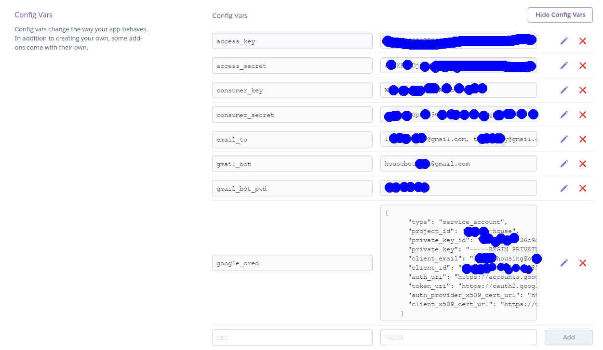

# Charlottenburg-daily
Everyday:
* Search Immobilienscout on new ads in Charlottenburg (Berlin)
* Update found results 
  * on [Twitter](https://twitter.com/Berlinhouse1) 
  * on personal Google Sheet with more details of the ads
  * to be sent to personal emails

To run the project, you need to do several things (more details in the reference):
 * Clone/fork this repository to your github.
 * Sign up for an Heroku account, create a new app. Deploy the app via Github.
 * Sign up for Twitter and [Twitter Dev](https://developer.twitter.com/en/dashboard) to have Twitter API keys (4 keys). Store these keys in the Heroku app, in ```Config Vars```. These values will be read later by ```os.environ[...]```
 * To connect to your Google Sheet, you need to create an authorization json file for Google Sheet API in [Google Console](https://console.developers.google.com/apis/dashboard). Store the file in Heroku app, in ```Config Vars```
 * To send email, you need to enter the emails you want to send in ```Config Vars```
 
      
 * You can check, or run Heroku app by going to the top right corner, ```More```, ```Run console```, type ```worker```. Heroku will run ```bot.py```.

References:
* Search on Immobilienscout24:
  * https://github.com/balzer82/immoscraper, using [BeautifulSoup](https://www.crummy.com/software/BeautifulSoup/bs4/doc/)
  * https://github.com/asmaier/ImmoSpider, using [Scrapy](https://scrapy.org/doc/)
* Host server for bot:
  * [Heroku via Github](https://github.com/tranvohuy/simple_twitter_bot_Heroku_via_Github)
  * [Heroku via HerokuCLI](https://github.com/tranvohuy/simple_twitter_bot)
* Twitter
  * [Twitter API](https://developer.twitter.com/en/docs.html)
  * [Tweepy](http://docs.tweepy.org/en/v3.5.0/getting_started.html), a python library to work with Twitter
  
* Json
   * [Google credential with json in Heroku](https://gist.github.com/hpiwowar/e8360c534444dc26f7fe65dabf138902)
   * [JSON parse](http://json.parser.online.fr/): very helpful to understand the data structure in Immobilienscout
   
 * Send email:
   * Using [Gmail API](https://github.com/shankarj67/python-gmail-api)
   * Using [smtplib](https://stackoverflow.com/questions/10147455/how-to-send-an-email-with-gmail-as-provider-using-python)
   
For future:
 * [Google](http://mfcabrera.com/blog/2015/1/17/ichbineinberliner.html) [map](https://github.com/mfcabrera/ichbineinberliner)
 * Send results to Messenger (Facebook)

